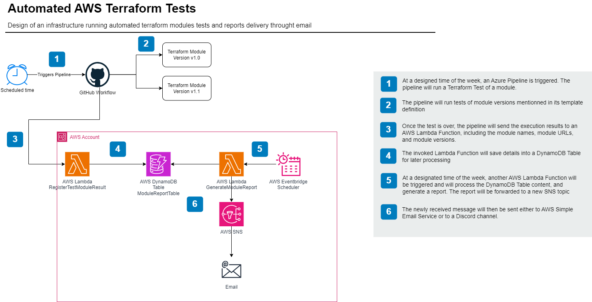

# Automated Terraform Test Factory

This project demonstrate a use case of an automated terraform module test factory using a GitHub Workflow, AWS and Terraform. In this repository, you will find examples of Terraform modules and their tests, a terraform code example that provision an infrastructure to generate a report of the results from your modules tests, and GitHub workflow files that allows you to automate the terraform tests process based on a cron expression.

## High Level Infrastructure



## Requirements

To use this solution, there are few requirements:
1. A GitHub repository (You may fork this one)
2. Text Editor: there are files you need to change and modify to your needs, this is **mandatory**
3. Terraform installed on your environment if you want to deploy the stack locally. In this project, I have been using version `1.11.3`
4. AWS Account (using a system that provide automated resource destruction, eg: aws-nuke)
5. IAM User with Access Key and Secret Access Key
6. Secrets within your GitHub Repository:
    - AWS_ACCESS_KEY_ID
    - AWS_SECRET_KEY

## Setup

To use this solution, there are few things to change and adapt. First, take a look at the workflows.

### GitHub Workflow

```yaml
env:
  MODULE_NAME: securitygroup
  MODULE_PATH: modules/securitygroup
  VERSIONS: "v1.0 v1.1 v1.1.1"
  LAMBDA_FUNCTION_NAME: register_module_result
  LAMBDA_REGION: eu-west-1
```

> [!IMPORTANT]
> You need to adapt these to your environment and modules. What would be a **best practice is to have a dedicated repository per Terraform module**, and a dedicated Workflow per repository. For the purpose of the demonstration, I have both of my modules in the same repository.

### Terraform Infrastructure 

> Local.tf

Inside of `infrastructure/locals.tf` you will find theses values:
```hcl
locals {
  sns_module_report_topic = "your_topic_name"
  ses_email_destination   = "your_email_address"
}
```

> provider.tf

Inside of `infrastructure/provider.tf`, there are few things you might want to change:
```hcl
terraform {
  required_providers {
    aws = {
      source  = "hashicorp/aws"
      version = "~> 5.0"
    }
  }

  backend "s3" {
    bucket = "your_bucket_name"
    key    = "terraform.tfstate"
    region = "your_aws_region"
  }
}

provider "aws" {
  region = "your_aws_region"
}

```
Edit them to your needs.

## Deploy

To deploy the infrastructure, you can run the command `make deploy` or run the following commands:
```bash
cd infrastructure
terraform init
terraform plan # Review results
terraform apply
```

